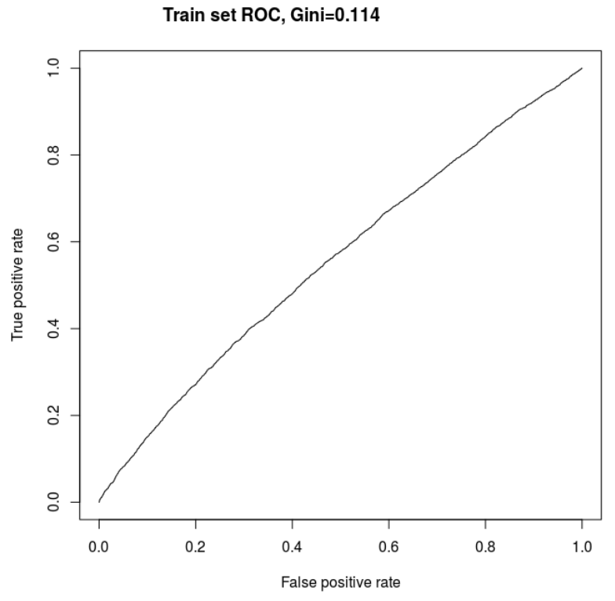
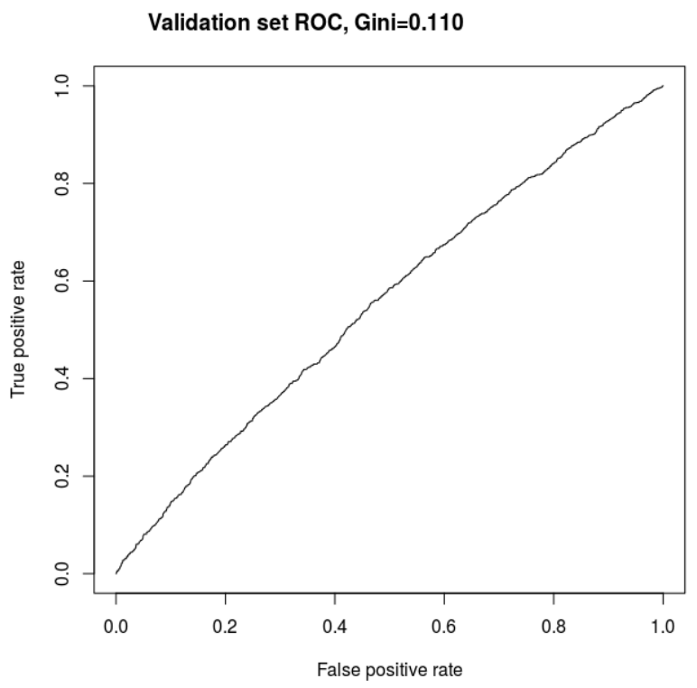

# Introduction

A peer-to-peer lending company has recently been acquired by a regional Australian bank. There are concerns regarding the credit risk models currently being used surround performance benchmarks. The analysts have been asked to rebuild the credit risk model from the ground up. Additionally, the analysts have been asked to consider variables such as time and address state/zip code to determine whether these variables are useful in predict credit risk.

Additionally, commentary will be provided regarding the variables used in the models obtained compared to traditional variables used to predict credit risk.

The analysts have taken the approach of modelling for two use cases. The first use case is one where the overall accuracy of the model is maximised. The second use case  aims to maximise the number of correctly predicted loan defaults (sensitivity). The aim of maximising sensitivity at the cost of correctly predicting successful loan repayments is that this will lead the bank to losing less money in the long run. A prediction of a successful repayment that eventually defaults costs the bank more money than a loan predicted to default that eventually fully repays their loan.

Models were selected based on justification given in the report and the best models based on certain criteria were selected. These models were then assessed for goodness of fit and prediction power on both seen and unseen data. The simple models were then compared to the benchmark models and the extended models to the simple models for each use case.

```{r, echo = FALSE, results = 'hide', message = FALSE, warnings = FALSE}
# install.packages("rlang", dependencies = TRUE)
# Import libraries
library(tidyverse)
library(GGally)
library(ggpubr)
library(gridExtra) # what does this package do?
library(lme4)
library(reshape2)
library(MASS)
library(stringr)
library(DHARMa)
library(AER)
library(pROC)
library(lattice)
library(lubridate)
# install.packages("caret")
library(caret)
```


# Data Cleaning/Wrangling

```{r}
# Import datasets
bm.train <- read.csv("benchmark_training_loan_data.csv", header = TRUE, row.names = 1)
bm.test <- read.csv("benchmark_testing_loan_data.csv", header = TRUE, row.names = 1)
bm.valid <- read.csv("benchmark_validation_loan_data.csv", header = TRUE, row.names = 1)
ev <- read.csv("extendend_version_loan_data.csv", header = TRUE, row.names = 1)
```


```{r}
# Investigate data structure
head(bm.train)
```

Several covariates need to be recoded:  
- Employment length was converted to an integer by removing extraneous strings and converting to integers n/a to NA
- Repay_fail converted to a factor
- term coded as a factor after removing "months"  
    - Kept the 36 and 60 as levels to make plotting more useful  
- home ownership to factor  
- verification_status to factor  
- purpose to factor  
- public record converted to a factor with levels 0 = no and 1 = yes  
- inquiries converted to a factor with 0 = no and 1 = yes

Because there is a large difference between some of the scales for the continuous variables, several of these were transformed using a log transform. Transformed variables are:  
- loan amount  
- annual income   
- revolving balance

```{r}
source("data_cleanup.r")

# Process the data
bm.train <- process_data(bm.train)
bm.test <- process_data(bm.test)
bm.valid <- process_data(bm.valid)
ev <- process_data(ev)
ev <- process_ev_data(ev)


# Remove NA values
bm.train <- remove_na(bm.train)
bm.test <- remove_na(bm.test)
bm.valid <- remove_na(bm.valid)
ev <- remove_na(ev)

head(bm.train)
```


# Exploratory Data Analysis

A number of plots exploring the effect of each covariate on loan default will be created.

## Exploratory Plots

``` {r}
# Create a boxplot for loan_amnt against repay_fail
loan_amnt_v_repay_fail <- ggplot(data = bm.train, aes(x = repay_fail, y = log_loan_amnt)) +
  geom_boxplot() +
  labs(
    title = "Relationship between Log Loan Amount \n and Repay Fail",
    x = "Repay Fail",
    y = "Loan Amount"
  )

# Create a bar plot to compare repay_fail and term
term_v_repay_fail <- ggplot(data = bm.train, aes(x = repay_fail, fill = term)) +
  geom_bar(position = "fill") +
  labs(
    title = "Comparison of Repay Fail by Term",
    x = "Repay Fail",
    y = "Proportion"
  )

# Create a boxplot for int_rate against repay_fail
int_rate_v_repay_fail <- ggplot(data = bm.train, aes(x = repay_fail, y = int_rate)) +
  geom_boxplot() +
  labs(
    title = "Relationship between Interest Rate \n and Repay Fail",
    x = "Repay Fail",
    y = "Interest Rate"
  )

# Create a line plot with log-transformed annual_inc
annual_inc_v_repay_fail <- ggplot(data = bm.train, aes(x = log_annual_inc, y = after_stat(density), color = repay_fail)) +
  geom_density() +
  labs(
    title = "Relationship between Log-Transformed \n Annual Income and Repay Fail",
    x = "Log-Transformed Annual Income",
    y = "Density",
    color = "Repay Fail"
  ) +
  scale_color_manual(values = c("0" = "blue", "1" = "red"))

# Create a boxplot for dti against repay_fail
dti_v_repay_fail <- ggplot(data = bm.train, aes(x = repay_fail, y = dti)) +
  geom_boxplot() +
  labs(
    title = "Relationship between dti and Repay Fail",
    x = "Repay Fail",
    y = "dti"
  )

# Create a bar plot to compare repay_fail and delinq_2yrs_categorical
delinq_2yrs_v_repay_fail <- ggplot(data = bm.train, aes(x = repay_fail, fill = delinq_2yrs_categorical)) +
  geom_bar(position = "fill") +
  labs(
    title = "Comparison of Repay Fail by Delinquencies",
    x = "Repay Fail",
    y = "Proportion"
  )

# inquiries last 6 months vs repay_fail
inq_last_6mth_v_repay_fail <- ggplot(data = bm.train, aes(x = repay_fail, fill = inq_last_6mths_categorical)) +
  geom_bar(position = "fill") +
  labs(
    title = "Comparison of Repay Fail by Inquiries \n past 6 months",
    x = "Repay Fail",
    y = "Proportion",
    fill = "Inquiries"
  )

# Create a bar plot to compare repay_fail and delinq_2yrs_categorical
pub_rec_v_repay_fail <- ggplot(data = bm.train, aes(x = repay_fail, fill = pub_rec_categorical)) +
  geom_bar(position = "fill") +
  labs(
    title = "Comparison of Repay Fail by Public Record",
    x = "Repay Fail",
    y = "Proportion",
    fill = "Public Record"
  )

# Create a line plot with log-transformed revol_bal
revol_bal_v_repay_fail <- ggplot(data = bm.train, aes(x = log_revol_bal, y = after_stat(density), color = repay_fail)) +
  geom_density() +
  labs(
    title = "Relationship between Log-Transformed \n Revolving Balance and Repay Fail",
    x = "Log-Transformed Revolving Balance",
    y = "Density",
    color = "Repay Fail"
  ) +
  scale_color_manual(values = c("0" = "blue", "1" = "red"))

# Create a line plot with revol_util
revol_util_v_repay_fail <- ggplot(data = bm.train, aes(x = revol_util, y = after_stat(density), color = repay_fail)) +
  geom_density() +
  labs(
    title = "Relationship between Revolving Utilization \n and Repay Fail",
    x = "Revolving Utilization",
    y = "Density",
    color = "Repay Fail"
  ) +
  scale_color_manual(values = c("0" = "blue", "1" = "red"))

# Create a boxplot for repay_fail against total_acc
total_acc_v_repay_fail <- ggplot(data = bm.train, aes(x = repay_fail, y = total_acc)) +
  geom_boxplot() +
  labs(
    title = "Relationship between Total Account \n and Repay Fail",
    x = "Repay Fail",
    y = "Total Account"
  )

# Create a boxplot for repay_fail against credit_age_yrs
credit_age_yrs_v_repay_fail <- ggplot(data = bm.train, aes(x = repay_fail, y = credit_age_yrs)) +
  geom_boxplot() +
  labs(
    title = "Relationship between Credit Age Years \n and Repay Fail",
    x = "Repay Fail",
    y = "Credit Age Years"
  )

# Verification status vs repay_fail
verification_status_v_repay_fail <- ggplot(data = bm.train, aes(x = verification_status, fill = repay_fail)) +
  geom_bar(position = "fill") +
  labs(
    title = "Relationship between Verification Status \n and Repay Fail",
    x = "Verification Status",
    y = "Proportion of Repay Fail",
    fill = "Repay Fail"
  )

# Create a boxplot for repay_fail against open_acc
open_acc_v_repay_fail <- ggplot(data = bm.train, aes(x = repay_fail, y = open_acc)) +
  geom_boxplot() +
  labs(
    title = "Relationship between Open Account \n and Repay Fail",
    x = "Repay Fail",
    y = "Open Account"
  )

# employment length and repay fail
emp_len_v_repay_fail <- ggplot(data = bm.train, aes(x = emp_length, fill = repay_fail)) +
  geom_bar(position = "fill") +
  labs(
    title = "Relationship between Employment Length \n and Repay Fail",
    x = "Employment Length",
    y = "Proportion of Repay Fail",
    fill = "Repay Fail"
  )

# purpose vs repay fail
purpose_v_repay_fail <- ggplot(data = bm.train, aes(x = purpose, fill = repay_fail)) +
  geom_bar(position = "fill") +
  labs(
    title = "Relationship between Purpose \n and Repay Fail",
    x = "Purpose",
    y = "Proportion of Repay Fail",
    fill = "Repay Fail"
  ) +
  theme(axis.text.x = element_text(angle = 45, hjust = 1, vjust = 1, color = "black"))
```

```{r, fig.height = 8, fig.width = 8}
ggarrange(loan_amnt_v_repay_fail, term_v_repay_fail, int_rate_v_repay_fail, annual_inc_v_repay_fail,
  nrow = 2, ncol = 2
)
```

```{r, fig.height = 8, fig.width = 8}
ggarrange(verification_status_v_repay_fail, dti_v_repay_fail, revol_bal_v_repay_fail, revol_util_v_repay_fail,
  nrow = 2, ncol = 2
)
```

```{r, fig.height = 8, fig.width = 8}
ggarrange(credit_age_yrs_v_repay_fail, inq_last_6mth_v_repay_fail, delinq_2yrs_v_repay_fail, pub_rec_v_repay_fail,
  nrow = 2, ncol = 2
)
```

```{r, fig.height = 8, fig.width = 8}
ggarrange(emp_len_v_repay_fail, purpose_v_repay_fail, total_acc_v_repay_fail, open_acc_v_repay_fail,
  nrow = 2, ncol = 2
)
```

The exploratory visualisations above depict the relationship between each covariate and loan default.

The visual effect of each covariate on repay_fail:  
- Loan amount: this plot indicates that there are more debtors with larger loans who repay their debt compared to the number of debtor with large debts who default. Overall, the loan amount appears to have a small effect on loan default.  
- Term: There is a higher proportion of debtors with a 60 month term who default compared to those with a 36 month term.  
- interest rate: Debtors with lower interest rates are more likely to repay their loans compared to those with higher interest rates.  
- Annual income (log transformed): There appears to be no effect of annual income on loan default.  
- Purpose: Proportion of loan defaults clearly fluctuates across different purposes.  
- DTI: There is an extremely small difference in the mean DTI between those who default on their loan and those who don't. Those who default have a mean approximately 1 unit DTI higher than those who successfully repay their debt.  
- Delinquencies in previous 2 years: Approximately 13% of those who default on their loans have experienced a delinquency in the previous 2 years whereas approximately 11-12% of those who successful repay their debts have experienced a delinquency. This is a very small difference.  
- Approximately 63% of those who defaulted had made inquiries in the previous 6 months compared to ~ 51% of those who repaid.  
- Public record: Approximately 10% of those who defaulted had a public record against them compared to approximate 5-6% of those who repaid their debt.  
- Revolving balance: No difference in revolving balance of those who defaulted compared to those who successfully repaid.  
- Revolving utilisation: The lines for those who defaulted and those who successfully repaid their debt show a clear difference in their trajectory indicating some kind of effect on repay_fail.  
- Total accounts: There is virtually no difference in the average total number of accounts between debtors who repay and those who default. Debtors who repay, however, do have some potential outliers in the numbers of accounts held.  
- Credit age (years): no real difference except more potential outliers in the age of credit for those who repay.  
- Verification status: No difference between Not Verified and Source verified. Verified shows a very small increase in the number of loan defaults.  
- Open accounts: virtually no difference in the number of accounts between those who default and those who repay.  
- Employment length: some tiny fluctuations across years employed for those who defaulted.  


## Test for multicollinearity

```{r}
# Create correlation matrix
bm.train.corr.df <- bm.train[, c("log_loan_amnt", "int_rate", "emp_length", "log_annual_inc", "dti", "open_acc", "log_revol_bal", "revol_util", "total_acc", "credit_age_yrs")]
cor.mat <- round(cor(bm.train.corr.df), 2)
melted.cor.mat <- melt(cor.mat)

# Plot correlation matrix
ggplot(
  data = melted.cor.mat,
  aes(x = Var1, y = Var2, fill = value)
) +
  geom_tile() +
  geom_text(aes(Var2, Var1, label = value)) +
  scale_fill_gradient2(
    low = "blue", high = "red",
    limit = c(-1, 1), name = "Correlation"
  ) +
  labs(title = "Correlation Heatmap - continuous variables") +
  theme(
    axis.title.x = element_blank(),
    axis.title.y = element_blank(),
    panel.background = element_blank(),
    axis.text = element_text(size = 10, color = "black"),
    axis.text.x = element_text(angle = 45, hjust = 1, vjust = 1, color = "black"),
    title = element_text(size = 12, color = "black")
  )
```

Only variables of possible concern are total_acc and open_acc with an $R^2$ of 0.69. These are two very similar covariates. To err on the side of caution, only one of these will be included when fitting each model.

This plot also shows some possible interactions between covariates. For example, the $R^2$ for several pairs of covariates suggest possible interaction terms: interest rate and revolving utilisation ($R^2 = 0.46$), income and loan amount ($R^2 = 0.44$) and total accounts and annual income ($R^2 = 0.42$). To determine whether there are any possible interaction effects at play between these covariates, they will be plotted across each level of repay fail. One other possible interaction term might be between term and interest rate. Given term is a categorical variable, it isn't included in the correlation heatmap. However, from a logical point, term and interest rate are highly likely to be interrelated. As the term gets longer and the interest rate higher, repayments are likely to be higher for longer which may result in more defaults. Similarly, high interest rates and shorter terms may also lead to more defaults if repayments are higher.

```{r, interaction plots}
# Revolving utilisation vs interest rate
revol_util_v_int_rate <- ggplot(bm.train, aes(x = revol_util, y = int_rate)) +
  geom_point(size = 0.2) +
  facet_wrap(~repay_fail) +
  geom_smooth(method = lm, se = FALSE) +
  # position_jitter(width = NULL, height = NULL, seed = NULL) +
  labs(
    title = "Relationship Between Interest Rate and Revolving \n Utilisation for each level of Repay Fail",
    x = "Revolving Utilisation",
    y = "Interest Rate",
    color = "Repay Fail"
  ) +
  theme(title = element_text(size = 8, color = "black"))

# Income and loan amount
ann_inc_v_loan_amnt <- ggplot(bm.train, aes(x = log_annual_inc, y = log_loan_amnt)) +
  geom_point(size = 0.2) +
  facet_wrap(~repay_fail) +
  geom_smooth(method = lm, se = FALSE) +
  # position_jitter(width = NULL, height = NULL, seed = NULL) +
  labs(
    title = "Relationship Between Loan Amount and Annual Income \n for each level of Repay Fail",
    x = "Annual Income",
    y = "Loan Amount",
    color = "Repay Fail"
  ) +
  theme(title = element_text(size = 8, color = "black"))

term_v_interest_rate <- ggplot(bm.train, aes(x = term, y = int_rate, fill = repay_fail)) +
  geom_boxplot() +
  # facet_wrap(~repay_fail) +
  labs(
    title = "Relationship Between Term length and \n Interest Rate for Each Level of Repay Fail",
    x = "Term",
    y = "Interest Rate",
    fill = "Repay Fail"
  ) +
  theme(title = element_text(size = 8, color = "black"))

loan_amnt_vs_int_rate <- ggplot(bm.train, aes(x = log_loan_amnt, y = int_rate, fill = repay_fail)) +
  geom_point(size = 0.2) +
  facet_wrap(~repay_fail) +
  geom_smooth(method = lm, se = FALSE) +
  labs(
    title = "Relationship Between Loan Amount and \n Interest Rate for Each Level of Repay Fail",
    x = "Loan Amount (log transformed)",
    y = "Interest Rate",
    fill = "Repay Fail"
  ) +
  theme(title = element_text(size = 8, color = "black"))
```

```{r, fig.width = 8, fig.height = 7}
ggarrange(ann_inc_v_loan_amnt, loan_amnt_vs_int_rate, term_v_interest_rate, revol_util_v_int_rate,
  nrow = 2, ncol = 2
)
```

There does not appear to be a relationship between loan amount and interest across levels of repay fail given the lines of best fit appear to be parallel. There also does not appear to be a relationship between loan amount and interest rate across levels of repay fail given the lines of best fit also appear to be parallel.

There is a clear relationship between term and interest rate across levels of repay fail with a higher interest rate leading to more loan defaults and a term of 60 months also leading to more loan defaults. For the 60 month term, the difference between the average interest rates across levels of loan default appears to be larger than for the 36 month term.

There appears to be a slight relationships between revolving utilisation and interest rate across levels of repay fail. This is indicated by the lines being non-parallel though this is a slight effect. 

The interaction terms will be added to the chosen model to determine whether they are useful for predicting loan defaults beyond the simple model.

# Model Selection

3 processes used to determine starting points for model selection:
1. Running an AIC on a full generalised linear model with no interaction terms
2. taking the full model and removing covariates that showed no clear effects in the exploratory plots
3. including variables that were found to be useful in some skimming of research paper

## Using stepwiseAIC
```{r}
# Null
null.model <- glm(formula = repay_fail ~ 1, data = bm.train, family = binomial(link = "logit"))

# no interactions
full.model <- glm(formula = repay_fail ~ ., data = bm.train, family = binomial(link = "logit"))

# Forward selection only returning null model

# backward selection
backward.sel.AIC <- stepAIC(full.model, direction = "backward", trace = F)
backward.sel.AIC$formula

# Forward and backward selection
both.sel.AIC <- stepAIC(full.model, direction = "both", trace = F)
both.sel.AIC$formula
```

The backward and bidirectional stepwise AIC formulas both agree on which covariates to include in the model. This suggests that the covariates have the potential to be useful in predicting loan defaults.

Setting two formula for Both.Sel.AIC to compare when using total_acc versus open_acc.
```{r}
# Set the formula as the both.sel.AIC model
both.sel.AIC.OpenAcc <- glm(
  formula = repay_fail ~ term + int_rate + emp_length + verification_status + purpose + open_acc +
    revol_util + pub_rec_categorical + inq_last_6mths_categorical + log_annual_inc + log_revol_bal + log_loan_amnt,
  data = bm.train, family = binomial(link = "logit")
)

# Comparing the model fits for total and open accounts

# Trying total account instead of open account
both.sel.AIC.TotAcc <- glm(
  formula = repay_fail ~ term + int_rate + emp_length + verification_status + purpose + total_acc +
    revol_util + pub_rec_categorical + inq_last_6mths_categorical + log_annual_inc + log_revol_bal + log_loan_amnt,
  data = bm.train, family = binomial(link = "logit")
)
```

## From exploratory plots

A model will be built that incorporates covariates that show a clear effect on repay_fail. The covariates that demonstrated a visually clear effect are:
- Term
- interest rate
- inquiries
- purpose
- Revolving utilisation
- verification status

Those with a very slight visual effect include:
- loan amount
- delinquencies
- dti
- public record
- total accounts
- open accounts
- credit age
- employment length

Therefore, one model to test will include the covariates with visually clear effects. Some models including combinations of the other variables will also be compared.

```{r}
# Model chosen by including variables with visible effects in plots
exp.plot.model.base <- glm(
  formula = repay_fail ~ int_rate + term + inq_last_6mths_categorical + purpose + revol_util + verification_status,
  data = bm.train, family = binomial(link = "logit")
)
```


## Based on Research Papers
Finally, another model was formed based upon variables that have been shown to be significant in a few research papers.

Three papers {@Paper1}{@Paper2}{@Paper3} all agreed that term and annual income were significant. Two of the three papers {@Paper2}{@Paper3} found income to be significant. {@Paper3} found dti, home ownership and public records to be significant. {@Paper1} found tax echelon and the number of credit cards owned to be significant, two variables our data does not contain. {@Paper2} also found an interaction between interest rate and loan amount to be significant, something that is contradictory to our exploratory plot of the same. The papers contained indications that revolving credit and revolving amount of credit being used were also useful. Therefore, a model will be built that contains interest rate, loan amount, term, home ownership, purpose, dti, annual income, revolving balance, revolving utilisation, delinquencies and employment length as covariates.

```{r}
# model chosen from research papers
model.research <- glm(
  formula = repay_fail ~ int_rate + log_loan_amnt + term + home_ownership + purpose + dti + log_annual_inc + log_revol_bal +
    revol_util + delinq_2yrs_categorical + emp_length,
  data = bm.train, family = binomial(link = "logit")
)
```


```{r, echo = FALSE, results = 'hide', message = FALSE}
models.v1 <- list(
  "BothSelOpenAcc" = both.sel.AIC.OpenAcc, # 12 cov
  "BothSelTotAcc" = both.sel.AIC.TotAcc,
  "ExpPlotsBase" = exp.plot.model.base,
  "ModelResearch" = model.research
)

# calculate measures of fit and seen prediction
aics.v1 <- sapply(models.v1, FUN = AIC)
bics.v1 <- sapply(models.v1, FUN = BIC)
logLiks.v1 <- sapply(models.v1, FUN = logLik)
AUCs.train.v1 <- sapply(models.v1, function(use_model) {
  pred <- predict(use_model, bm.train, type = c("response"))
  auc <- auc(roc(bm.train$repay_fail, pred))
})
gini.train.v1 <- (2 * AUCs.train.v1) - 1
sens.train.v1 <- sapply(models.v1, function(use_model, use_data) {
  pred2 <- predict(use_model, bm.train, type = c("response"))
  roc2 <- roc(bm.train$repay_fail ~ pred2)
  sens <- round(coords(roc2, x = "best", ret = c("sensitivity")), 5)
  sens$sensitivity
})
spec.train.v1 <- sapply(models.v1, function(use_model, use_data) {
  pred2 <- predict(use_model, bm.train, type = c("response"))
  roc2 <- roc(bm.train$repay_fail ~ pred2)
  spec <- round(coords(roc2, x = "best", ret = c("specificity")), 5)
  spec$specificity
})
acc.train.v1 <- sapply(models.v1, function(use_model, use_data) {
  pred2 <- predict(use_model, bm.train, type = c("response"))
  roc2 <- roc(bm.train$repay_fail ~ pred2)
  sens <- round(coords(roc2, x = "best", ret = c("accuracy")), 5)
  sens$accuracy
})
AUCs.test.v1 <- sapply(models.v1, function(use_model) {
  pred <- predict(use_model, bm.test, type = c("response"))
  auc <- auc(roc(bm.test$repay_fail, pred))
})
gini.test.v1 <- (2 * AUCs.test.v1) - 1
sens.test.v1 <- sapply(models.v1, function(use_model, use_data) {
  pred2 <- predict(use_model, bm.test, type = c("response"))
  roc2 <- roc(bm.test$repay_fail ~ pred2)
  sens <- round(coords(roc2, x = "best", ret = c("sensitivity")), 5)
  sens$sensitivity
})
spec.test.v1 <- sapply(models.v1, function(use_model, use_data) {
  pred2 <- predict(use_model, bm.test, type = c("response"))
  roc2 <- roc(bm.test$repay_fail ~ pred2)
  spec <- round(coords(roc2, x = "best", ret = c("specificity")), 5)
  spec$specificity
})
acc.test.v1 <- sapply(models.v1, function(use_model, use_data) {
  pred2 <- predict(use_model, bm.test, type = c("response"))
  roc2 <- roc(bm.test$repay_fail ~ pred2)
  sens <- round(coords(roc2, x = "best", ret = c("accuracy")), 5)
  sens$accuracy
})

# Aggregate into data-frame for plotting
plot_measures.v1 <- data.frame(
  models <- c("BothSelOpenAcc", "BothSelTotAcc", "ExpPlotsBase", "ModelResearch"),
  AIC <- aics.v1,
  BIC <- bics.v1,
  LogLike <- logLiks.v1,
  AUCs.train = AUCs.train.v1,
  gini.train <- gini.train.v1,
  sens.train <- sens.train.v1,
  spec.train <- spec.train.v1,
  acc.train <- acc.train.v1,
  AUCs.test <- AUCs.test.v1,
  gini.test <- gini.test.v1,
  sens.test <- sens.test.v1,
  spec.test <- spec.test.v1,
  acc.test <- acc.test.v1
)

# Display with measures
knitr::kable(plot_measures.v1,
  row.names = FALSE,
  col.names = c("Model", "AIC", "BIC", "log-Likelihood", "AUC_Train", "Gini_Train", "Sens_Train", "Spec_Train", "Acc_Train", "AUC_Test", "Gini_Test", "Sens_Test", "Spec_Test", "Acc_Test")
)
```

From the initial four models, the models drawn from the stepwise AIC show slightly better predictive performance compared to the models drawn from the exploratory plots and research. However, given the AIC values are in the 17 thousands, these differences are very small with a difference of  205.1 between the largest and smallest AIC values.

Therefore, the the covariates across the 3 models will be included in a single model. From there, different combinations of covariates will be assessed to determine which model will likely produce the most accurate predictions of loan default. Covariates with no visible effect in the exploratory plots will be removed one-by-one, the result observed, and then a decision made whether or not to include or exclude that covariate from the model. The result and decision are noted in the comments in the below code chunk.

```{r}
# A model including all variables from the 3 models. Using OpenAcc due to very slight improvement in predictions compared to total_acc
# Combined model
combined.model <- glm(
  formula = repay_fail ~ term + int_rate + emp_length + verification_status + purpose + dti + open_acc +
    revol_util + log_revol_bal + pub_rec_categorical + inq_last_6mths_categorical + log_annual_inc + log_loan_amnt,
  data = bm.train, family = binomial(link = "logit")
)

# Remove Annual Income and RevolBal
cm.noAnnIncRevolBal <- glm(
  formula = repay_fail ~ term + int_rate + emp_length + verification_status + purpose + dti + open_acc +
    revol_util + pub_rec_categorical + inq_last_6mths_categorical + log_loan_amnt,
  data = bm.train, family = binomial(link = "logit")
)

# taking those two out slightly worsened predictions, yet they have no visible effect on repay_fail.
# Leave out and try removing other variables

cm.noAnnIncRevolBalEmpLen <- glm(
  formula = repay_fail ~ term + int_rate + verification_status + purpose + dti + open_acc +
    revol_util + pub_rec_categorical + inq_last_6mths_categorical + log_loan_amnt,
  data = bm.train, family = binomial(link = "logit")
)

# very slight improvement compared to model without annual income and revol bal
# try removing DTI
cm.noAnnIncRevolBalEmpLenDti <- glm(
  formula = repay_fail ~ term + int_rate + verification_status + purpose + open_acc +
    revol_util + pub_rec_categorical + inq_last_6mths_categorical + log_loan_amnt,
  data = bm.train, family = binomial(link = "logit")
)

# slightly worse, try removing Public Rec
cm.noAnnIncRevolBalEmpLenDtiPubRec <- glm(
  formula = repay_fail ~ term + int_rate + verification_status + purpose + open_acc +
    revol_util + inq_last_6mths_categorical + log_loan_amnt,
  data = bm.train, family = binomial(link = "logit")
)

# slightly worse again, remove purpose
cm.noAnnIncRevolBalEmpLenDtiPubRecPurp <- glm(
  formula = repay_fail ~ term + int_rate + verification_status + open_acc +
    revol_util + inq_last_6mths_categorical + log_loan_amnt,
  data = bm.train, family = binomial(link = "logit")
)

# try total accounts instead
cm.TotAcc.noAnnIncRevolBalEmpLenDtiPubRecPurp <- glm(
  formula = repay_fail ~ term + int_rate + verification_status + total_acc +
    revol_util + inq_last_6mths_categorical + log_loan_amnt,
  data = bm.train, family = binomial(link = "logit")
)

# slight improvement, try previous models with total accounts instead
# Remove Annual Income and RevolBal
cm.TotAcc.noAnnIncRevolBal <- glm(
  formula = repay_fail ~ term + int_rate + emp_length + verification_status + purpose + dti + total_acc +
    revol_util + pub_rec_categorical + inq_last_6mths_categorical + log_loan_amnt,
  data = bm.train, family = binomial(link = "logit")
)

# slight improvement, try next model
cm.TotAcc.noAnnIncRevolBalEmpLen <- glm(
  formula = repay_fail ~ term + int_rate + verification_status + purpose + dti + total_acc +
    revol_util + pub_rec_categorical + inq_last_6mths_categorical + log_loan_amnt,
  data = bm.train, family = binomial(link = "logit")
)

# very slight improvement on the test predictions, keep out
cm.noAnnIncRevolBalEmpLenDti <- glm(
  formula = repay_fail ~ term + int_rate + verification_status + purpose + open_acc +
    revol_util + pub_rec_categorical + inq_last_6mths_categorical + log_loan_amnt,
  data = bm.train, family = binomial(link = "logit")
)

# slightly worse fit, keep dti in
cm.TotAcc.noAnnIncRevolBalEmpLenLoanAmnt <- glm(
  formula = repay_fail ~ term + int_rate + verification_status + purpose + dti + total_acc +
    revol_util + pub_rec_categorical + inq_last_6mths_categorical,
  data = bm.train, family = binomial(link = "logit")
)

# slight improvement, take out public rec
cm.TotAcc.noAnnIncRevolBalEmpLenLoanAmntPubRec <- glm(
  formula = repay_fail ~ term + int_rate + verification_status + purpose + dti + total_acc +
    revol_util + inq_last_6mths_categorical,
  data = bm.train, family = binomial(link = "logit")
)

# slightly worse, keep pub rec, try removing inquiries
cm.TotAcc.noAnnIncRevolBalEmpLenLoanAmnt.Inq <- glm(
  formula = repay_fail ~ term + int_rate + verification_status + purpose + dti + total_acc +
    revol_util + pub_rec_categorical,
  data = bm.train, family = binomial(link = "logit")
)

# slightly worse fit, keep inqu, try removing purpose
cm.TotAcc.noAnnIncRevolBalEmpLenLoanAmntPubRecPurp <- glm(
  formula = repay_fail ~ term + int_rate + verification_status + dti + total_acc +
    revol_util + inq_last_6mths_categorical,
  data = bm.train, family = binomial(link = "logit")
)

# Best model previously for sensitivity
exp.plot.model.v2 <- glm(repay_fail ~ int_rate + term + inq_last_6mths_categorical + pub_rec_categorical + revol_util +
  verification_status + total_acc, data = bm.train, family = binomial(link = "logit"))

# An an experiement, try home ownership on better model from here
cm.TotAccHomeOwn.noAnnIncRevolBalEmpLen <- glm(
  formula = repay_fail ~ term + int_rate + verification_status + purpose + dti + total_acc +
    revol_util + pub_rec_categorical + inq_last_6mths_categorical + log_loan_amnt + home_ownership,
  data = bm.train, family = binomial(link = "logit")
)

# An an experiment, try delinquencies on better model from here
cm.TotAccDelinq.noAnnIncRevolBalEmpLen <- glm(
  formula = repay_fail ~ term + int_rate + verification_status + purpose + dti + total_acc +
    revol_util + pub_rec_categorical + inq_last_6mths_categorical + log_loan_amnt + delinq_2yrs_categorical,
  data = bm.train, family = binomial(link = "logit")
)

# home own made slight improvement, try removing loan amount
cm.TotAccHomeOwn.noAnnIncRevolBalEmpLenLoanAmnt <- glm(
  formula = repay_fail ~ term + int_rate + verification_status + purpose + dti + total_acc +
    revol_util + pub_rec_categorical + inq_last_6mths_categorical + home_ownership,
  data = bm.train, family = binomial(link = "logit")
)

# slightly worse keep loan amount in
```

The below table displays the AIC, BIC, log-likelihood and the AUC, Gini Index, Sensitivity, Specificity and Accuracy for each of the models tested. It should be noted that the Sensitivity, Specificity and Accuracy figures are determined using their best threshold from the ROC plots and will differ to the final calculations of Accuracy, Sensitivity and Specificity.

```{r, echo = FALSE, results = 'hide', message = FALSE}
models.v2 <- list(
  "BothSelOpenAcc" = both.sel.AIC.OpenAcc, # 12 cov
  "BothSelTotAcc" = both.sel.AIC.TotAcc,
  "ExpPlotsBase" = exp.plot.model.base,
  "ModelResearch" = model.research,
  "CombinedModel" = combined.model,
  "m1" = cm.noAnnIncRevolBal,
  "m2" = cm.noAnnIncRevolBalEmpLen,
  "m3" = cm.noAnnIncRevolBalEmpLenDti,
  "m4" = cm.noAnnIncRevolBalEmpLenDtiPubRec,
  "m5" = cm.noAnnIncRevolBalEmpLenDtiPubRecPurp,
  "m6" = cm.TotAcc.noAnnIncRevolBalEmpLenDtiPubRecPurp,
  "m7" = cm.TotAcc.noAnnIncRevolBal,
  "m8" = cm.TotAcc.noAnnIncRevolBalEmpLen,
  "m9" = cm.noAnnIncRevolBalEmpLenDti,
  "m10" = cm.TotAcc.noAnnIncRevolBalEmpLenLoanAmnt,
  "m11" = cm.TotAcc.noAnnIncRevolBalEmpLenLoanAmntPubRec,
  "m12" = cm.TotAcc.noAnnIncRevolBalEmpLenLoanAmnt.Inq,
  "m13" = cm.TotAcc.noAnnIncRevolBalEmpLenLoanAmntPubRecPurp,
  "exp.plot.model.v2" = exp.plot.model.v2,
  "m15" = cm.TotAccHomeOwn.noAnnIncRevolBalEmpLen,
  "m16" = cm.TotAccDelinq.noAnnIncRevolBalEmpLen,
  "m17" = cm.TotAccHomeOwn.noAnnIncRevolBalEmpLenLoanAmnt
)

# calculate measures of fit and seen prediction
aics.v2 <- sapply(models.v2, FUN = AIC)
bics.v2 <- sapply(models.v2, FUN = BIC)
logLiks.v2 <- sapply(models.v2, FUN = logLik)
AUCs.train.v2 <- sapply(models.v2, function(use_model) {
  pred <- predict(use_model, bm.train, type = c("response"))
  auc <- auc(roc(bm.train$repay_fail, pred))
})
gini.train.v2 <- (2 * AUCs.train.v2) - 1
sens.train.v2 <- sapply(models.v2, function(use_model, use_data) {
  pred2 <- predict(use_model, bm.train, type = c("response"))
  roc2 <- roc(bm.train$repay_fail ~ pred2)
  sens <- round(coords(roc2, x = "best", ret = c("sensitivity")), 5)
  sens$sensitivity
})

spec.train.v2 <- sapply(models.v2, function(use_model, use_data) {
  pred2 <- predict(use_model, bm.train, type = c("response"))
  roc2 <- roc(bm.train$repay_fail ~ pred2)
  spec <- round(coords(roc2, x = "best", ret = c("specificity")), 5)
  spec$specificity
})
acc.train.v2 <- sapply(models.v2, function(use_model, use_data) {
  pred2 <- predict(use_model, bm.train, type = c("response"))
  roc2 <- roc(bm.train$repay_fail ~ pred2)
  sens <- round(coords(roc2, x = "best", ret = c("accuracy")), 5)
  sens$accuracy
})
AUCs.test.v2 <- sapply(models.v2, function(use_model) {
  pred <- predict(use_model, bm.test, type = c("response"))
  auc <- auc(roc(bm.test$repay_fail, pred))
})
gini.test.v2 <- (2 * AUCs.test.v2) - 1
sens.test.v2 <- sapply(models.v2, function(use_model, use_data) {
  pred2 <- predict(use_model, bm.test, type = c("response"))
  roc2 <- roc(bm.test$repay_fail ~ pred2)
  sens <- round(coords(roc2, x = "best", ret = c("sensitivity")), 5)
  sens$sensitivity
})
spec.test.v2 <- sapply(models.v2, function(use_model, use_data) {
  pred2 <- predict(use_model, bm.test, type = c("response"))
  roc2 <- roc(bm.test$repay_fail ~ pred2)
  spec <- round(coords(roc2, x = "best", ret = c("specificity")), 5)
  spec$specificity
})
acc.test.v2 <- sapply(models.v2, function(use_model, use_data) {
  pred2 <- predict(use_model, bm.test, type = c("response"))
  roc2 <- roc(bm.test$repay_fail ~ pred2)
  sens <- round(coords(roc2, x = "best", ret = c("accuracy")), 5)
  sens$accuracy
})

# Aggregate into data-frame for plotting
plot_measures <- data.frame(
  models.v2 = c("BothSelOpenAcc", "BothSelTotAcc", "ExpPlotsBase", "ModelResearch", "CombinedModel", "m1", "m2", "m3", "m4", "m5", "m6", "m7", "m8", "m9", "m10", "m11", "m12", "m13", "exp.plot.model.v2", "m15", "m16", "m17"),
  AIC = aics.v2,
  BIC = bics.v2,
  LogLike = logLiks.v2,
  AUCs.train = AUCs.train.v2,
  gini.train <- gini.train.v2,
  sens.train <- sens.train.v2,
  spec.train <- spec.train.v2,
  acc.train <- acc.train.v2,
  AUCs.test <- AUCs.test.v2,
  gini.test <- gini.test.v2,
  sens.test <- sens.test.v2,
  spec.test <- spec.test.v2,
  acc.test <- acc.test.v2
)

# Display with measures
knitr::kable(plot_measures,
  row.names = FALSE,
  col.names = c("Models", "AIC", "BIC", "log-Likelihood", "AUC_Train", "Gini_Train", "Sens_Train", "Spec_Train", "Acc_Train", "AUC_Test", "Gini_Test", "Sens_Test", "Spec_Test", "Acc_Test")
)
```

It is interesting that the model with the highest number of variables (Combined Model) shows the second lowest AIC and third lowest BIC value and the highest log likelihood. This is interesting because AIC and BIC values penalise models with more parameters. However, it performs slightly worse than the stepwise AIC model that uses open accounts when it comes to the Gini Index on the benchmark test data.

Additionally, it is interesting that, adding home ownership and delinquencies back into the models after removing several other covariates that the model estimates improved slightly. These improvements weren't enough to warrant using these models over the chosen ones though.

### Conclusion of Model Selection

We have decided on a two-pronged approach based on two different scenarios. The first use case is the one where the bank might want to predict the highest number of applications correctly. The second is where the bank wants to maximise the number of correct predictions of loan defaults.

The model chosen for the first use case will be the model with the highest Gini Index based on the unseen prediction (Gini_Test). This model aims to maximise the overall number of correct predictions and is a more conservative model than that for the second use case. The model for this use case is both.sel.AIC.OpenAcc (Gini_Test = 0.3645).

The second use case is the one where the bank might want to maximise the number of correct predictions of loan defaults. There is a trade-off in this use case. By increasing the number of correct predictions of loan default, the bank will correctly predict fewer cases where applicants successfully repay their loan. This use case is likely to lead to a smaller amount of money lost in the long run. Applicants who were predicted to successfully repay their loan, but who end up defaulting, will cost the bank more money than applicants who were predicted to default but instead successfully repay their loan. The model for the use case is exp.plot.model.v2 (Sens_Test = 0.80419).

The goodness of fit for both of these models will be assessed and a comparison to the benchmark model made.

# Use Case 1: Highest overall prediction accuracy

##Goodness of Fit

### Test of Deviance

This test assesses the residual deviances of each covariate by essentially performing a test of equal means.

```{r}
anova(both.sel.AIC.OpenAcc, test = "Chisq")
```

There are signs of significant deviance from expected values in all covariates except employment length and number of open accounts.


### $\hat{\phi}$ test of overdispersion


```{r}
# phi-hat test of overdispersion
Nmp.m.1 <- both.sel.AIC.OpenAcc$df.residual # N - p
phi_hat.m.1 <- deviance(both.sel.AIC.OpenAcc) / Nmp.m.1
print(phi_hat.m.1)
phi_hat.m.1 > 1 + 3 * sqrt(2 / Nmp.m.1)
```

$\hat{\phi} = 0.798$ is less than $1 + 3 \sqrt{\frac{2}{N-k}} = 1.028$. Therefore, this test does not indicate any overdispersion in the data.

All of these tests so far indicate no signs of overdispersion.  
However, the true test comes with the simulated residuals.

### Simulated residuals

```{r}
simRes.m.1 <- simulateResiduals(both.sel.AIC.OpenAcc)
plot(simRes.m.1)
```

This QQ-plot looks too perfect, especially when the right plot only has 1 line clearly visible. A good model fit would have three roughly horizontal lines approximately equidistant between 0 and 1 on the y-axis. Beyond that, this QQ-plot assumed residuals are distributed uniformly. That is not the case here (confirm this last point) as the response variable is binomial. 
The authors of the DHARMa package, thankfully, give good instructions on how to simulate residuals more appropriately in this scenario {@DHARMa}. A grouping variable is introduced when recalculating the simulated residuals. 

Needed to add in a grouping variable. Purpose was chosen in this scenario as it has the largest number of groups within the variable for the benchmark training dataset and is a naturally occurring grouping variable in the dataset given it groups loans by the purpose for the loan. 

```{r}
# checking different plot due to 0/1 out come data
reCalcRes.m.1 <- recalculateResiduals(simRes.m.1, group = bm.train$purpose)
plot(reCalcRes.m.1)
```

This gives us results more in line with what would be expected and indicates highly significant overdispersion the data. The caveat to this is that there are only 14 levels creating the groups for recalculating the simulated residuals. This is not a particularly large number of data points.

This model demonstrates a relatively poor fit to the data. 

Now to test the probit and cloglog link functions. Recall the AIC for both.sel.AIC.OpenAcc is 17593.66.

```{r}
# Probit
both.sel.AIC.OpenAcc.probit <- glm(formula = both.sel.AIC.OpenAcc$formula, data = bm.train, family = binomial(link = "probit"))

# cloglog
both.sel.AIC.OpenAcc.cloglog <- glm(formula = both.sel.AIC.OpenAcc$formula, data = bm.train, family = binomial(link = "cloglog"))
```


```{r}
cat("Log-Likelihood: Use Case 1 Logit = ", logLik(both.sel.AIC.OpenAcc), "\n")
cat("Log-Likelihood: Use Case 1 Proit = ", logLik(both.sel.AIC.OpenAcc.probit), "\n")
cat("Log-Likelihood: Use Case 1 Cloglog = ", logLik(both.sel.AIC.OpenAcc.cloglog), "\n")

cat("AIC:Use Case 1 Logit = ", round(extractAIC(both.sel.AIC.OpenAcc), 4), "\n")
cat("AIC: Use Case 1 Probit: = ", round(extractAIC(both.sel.AIC.OpenAcc.probit), 4), "\n")
cat("AIC: Use Case 1 Cloglog - ", round(extractAIC(both.sel.AIC.OpenAcc.cloglog), 4), "\n")
```

Both log-likelihood and AIC values suggest the probit link function provides a slightly better model fit compared to the standard logit link function while the cloglog link function gives a slightly worse model fit. However, these differences are very small. Therefore, because the response data is 0/1 Bernoulli data, and to ensure ease of interpretation, the logit link function will be retained.

## Predictive Performance

### Seen Data

To test how well the model predicts the loan default in the current dataset.

```{r}
both.sel.AIC.OpenAcc.roc <- plot_roc(both.sel.AIC.OpenAcc, bm.train)
```

This model returns an Area Under the Curve (AUC) of 0.701 with a Gini Index of 0.402. To ensure the model has not been overfit, the model will be fit to the testing data.


### Unseen data
Testing how well this model will predict unseen data by running the model on the benchmark testing dataset.

```{r}
both.sel.AIC.OpenAcc.roc <- plot_roc(both.sel.AIC.OpenAcc, bm.test)
```

There are no indications of overfitting the model as the Gini Index dropped from 0.402 in the training model to 0.365 using the benchmark testing dataset.

Calculating a confusion matrix for the simple model on the validation dataset.

```{r}
# Confusion Matrix on validation data
pred.uC.1 <- predict(both.sel.AIC.OpenAcc, bm.test, type = c("response"), replace = TRUE)
pred.uC.1 <- ifelse(pred.uC.1 >= 0.5, "1", "0")
pred.uC.1 <- as.factor(pred.uC.1)

confusMat.uC.1 <- confusionMatrix(data = pred.uC.1, reference = bm.test$repay_fail)
confusMat.uC.1
```


## Consider interaction term

Want to quickly compare the chosen model to one with 2 interaction terms. It seems highly improbable that a dataset as complex as this one would not have 2 or more covariates influencing each other.

Based upon the exploratory plots interaction terms of interest rate * term and interest rate * revol_util will be included.

```{r}
both.sel.AIC.OpenAcc.Int <- glm(
  formula = repay_fail ~ term + int_rate + emp_length + verification_status + purpose + open_acc + revol_util +
    pub_rec_categorical + inq_last_6mths_categorical + log_annual_inc + log_revol_bal + log_loan_amnt + term * int_rate + int_rate * revol_util,
  data = bm.train, family = binomial(link = "logit")
)

summary(both.sel.AIC.OpenAcc.Int)
```

The complex model will be compared to the simple model to determine whether the interaction terms explain significantly more variance in the data.

```{r}
anova(both.sel.AIC.OpenAcc, both.sel.AIC.OpenAcc.Int, test = "Chisq")
```

With $p = 7.988e^{-07}$, the interaction terms are needed as they explain significantly more variance than the model without said terms. 

Testing the goodness of fit for the model with the interaction term.

```{r}
simRes.m.1.Int <- simulateResiduals(both.sel.AIC.OpenAcc.Int)

# checking different plot due to 0/1 out come data
reCalcRes.m.1.Int <- recalculateResiduals(simRes.m.1.Int, group = bm.train$purpose)
plot(reCalcRes.m.1.Int)
```

The model with the interaction term appears to worsen the goodness of fit. The KS test for the simple model returned a value of $p = 0.0035$ whereas the complex model KS test gives $p = 0.00191$. Additionally, the Residuals vs fitted plots loses some of the distance between the lines that was visible in the plot for the simple model. Yet, the complex model explains more variance in the data.


To determine if including the interaction terms improves the prediction of unseen data, compare the prediction on unseen data between the model with interaction and the model without.

Visualising the ROC plot for the complex model predictions of unseen data.

```{r}
# Predicting unseen data with complex model
both.sel.AIC.OpenAcc.Int.roc <- plot_roc(both.sel.AIC.OpenAcc.Int, bm.test)
```

The complex model predictions on unseen data return a Gini Index score of 0.3689. This is slightly larger than the Gini Index for the simple model (Gini Index = 0.365).


Constructing a confusion matrix for the complex model on the testing dataset.

```{r}
# Confusion Matrix on validation data interaction model
pred.uC.1.Int <- predict(both.sel.AIC.OpenAcc.Int, bm.test, type = c("response"), replace = TRUE)
pred.uC.1.Int <- ifelse(pred.uC.1.Int >= 0.5, "1", "0")
pred.uC.1.Int <- as.factor(pred.uC.1.Int)

confusMat.uC.1.Int <- confusionMatrix(data = pred.uC.1.Int, reference = bm.test$repay_fail)
confusMat.uC.1.Int
```

While the model fit is significantly improved by adding in the interaction terms ($p = 7.988 e^{-07}$), the accuracy of the predictions worsens slightly. The accuracy for the simple model is 85.19% (95% CI = (0.8436, 0.8599)) whereas for the complex model, the accuracy is 85.14% with a 95% CI = (0.8431, 0.8593). 

Both these models were run on unseen data and the complex model worsened prediction accuracy by 0.05%). In the interests of parsimony, the model without the interaction terms will be used despite the more complex model showing an improvement in the model fit.

## Interpreting the results.

```{r}
# Store output
out.both.sel.AIC.OpenAcc <- summary(both.sel.AIC.OpenAcc)

# create vectors
betas <- c(out.both.sel.AIC.OpenAcc$coefficients[, 1])
std.errs <- c(out.both.sel.AIC.OpenAcc$coefficients[, 2])
pvalues <- c(out.both.sel.AIC.OpenAcc$coefficients[, 4])

# as data frame
interp <- data.frame(betas, std.errs, pvalues)

# Calculate Odds ratios and CIs
interp$OR <- exp(betas)
interp$OR_LL <- exp(betas - (1.965 * std.errs))
interp$OR_UL <- exp(betas + (1.965 * std.errs))

# Display
interp[, c("betas", "OR", "OR_LL", "OR_UL")]
```

Because the coefficients are all on different scales, they were first standardised by transforming the raw output into Odds Ratios. The effect sizes for all Odds Rations are significant as none of the 95% confidence intervals cross 0.

The coefficient with the largest odds ratio is a term of 60 months where moving to a 60 month term from a 36 month term leads to a 3.26% increase in the odds of defaulting on the loan (CI = 1.379, 7.707). Applying for a loan for a small business leads to a 2.756 increase in the odds of loan default (95% CI = 2.119, 3.586) compared to a loan for an 'Other' purpose. For a 1 unit increase in revolving utilisation, the odds of loan default increase by 0.88 times (95% CI = 1.517, 2.259). Annual income shows the weakest effect on loan default with a 1 unit increase in income leading to a 0.569 times increase in the odds of loan default (95% CI = 0.522, 0.62). The next two weakest effect sizes are purpose (credit card) and purpose (wedding) which lead to an increase in the odds of loan default by 0.869 (95% CI = 0.675, 1.12) and 0.88 (95% CI = 0.614, 1.261) times respectively.


# Use Case 1: Conclusion

After selecting a model based on its Gini Index when fit to unseen data, the goodness of fit and prediction accuracy were assessed. 

The model for Use Case 1 showed significant signs of deviance and there were no indications of overdispersion from the $\hat{\phi}$ test of overdispersion. However, after running the simulated residuals on grouped data, there were clear signs of overdispersion in the data.

There was no indication of model overfitting given the AUC and Gini Index values dropped slightly between fitting the model to the training and testing data.

A confusion matrix was constructed after using the simple model predict loan default in the benchmark test dataset. The model gives an accuracy of 85.19%. 


# Use Case 2 - Goodness of Fit

The aim of this model is to maximise sensitivity at the cost of specificity with the aim to correctly predict as many loan defaults as possible. This should save the bank money in the long run.

## Goodness of Fit
### Deviance

```{r}
anova(exp.plot.model.v2, test = "Chisq")
```
All covariates show significant signs of deviance.

### Dispersion test

```{r}
# phi-hat test of overdispersion
Nmp.m.2 <- exp.plot.model.v2$df.residual # N - p
phi_hat.m.2 <- deviance(exp.plot.model.v2) / Nmp.m.2
print(phi_hat.m.2)
phi_hat.m.2 > 1 + 3 * sqrt(2 / Nmp.m.2)
```

There are no indications of dispersion using the $\hat{\phi}$ test.

### Simulated Residuals

```{r}
simRes.m.2 <- simulateResiduals(exp.plot.model.v2)

# checking different plot due to 0/1 out come data
reCalcRes.m.2 <- recalculateResiduals(simRes.m.2, group = bm.train$purpose)
plot(reCalcRes.m.2)
```

The recalculated simulated residuals plot indicates there is overdispersion. 

Next, will compare the model to one with the probit and cloglog link functions.

```{r}
# Probit
exp.plot.model.v2.probit <- glm(formula = exp.plot.model.v2$formula, data = bm.train, family = binomial(link = "probit"))

# cloglog
exp.plot.model.v2.cloglog <- glm(formula = exp.plot.model.v2$formula, data = bm.train, family = binomial(link = "cloglog"))
```

Summarising output
```{r}
cat("Log-Likelihood: Use Case 2 Logit = ", logLik(exp.plot.model.v2), "\n")
cat("Log-Likelihood: Use Case 2 Proit = ", logLik(exp.plot.model.v2.probit), "\n")
cat("Log-Likelihood: Use Case 2 Cloglog = ", logLik(exp.plot.model.v2.cloglog), "\n")

cat("AIC: Use Case 2 Logit = ", round(extractAIC(exp.plot.model.v2), 4), "\n")
cat("AIC: Use Case 2 Probit: = ", round(extractAIC(exp.plot.model.v2.probit), 4), "\n")
cat("AIC: Use Case 2 Cloglog - ", round(extractAIC(exp.plot.model.v2.cloglog), 4), "\n")
```
As with use case 1, the model fit using the logit link function falls between the models fit using the probit and cloglog link functions. Again, there is a very small difference (difference in the tens with values in the tens of thousands) in the results of the AIC, BIC and log likelihood values for the models. Therefore, for ease of interpretation the logit link function will be retained.


## Prediction Performance
### Seen data

```{r}
source("data_cleanup.r")
exp.plot.model.v2.roc <- plot_roc(exp.plot.model.v2, bm.train)
```

```{r}
# Confusion Matrix on validation data
pred.uC.2 <- predict(exp.plot.model.v2, bm.train, type = c("response"), replace = TRUE)
pred.uC.2 <- ifelse(pred.uC.2 >= 0.5, "1", "0")
pred.uC.2 <- as.factor(pred.uC.2)

confusMat.uC.2 <- confusionMatrix(data = pred.uC.2, reference = bm.train$repay_fail)
confusMat.uC.2
```

The prediction performance on seen data for use case 2 gives an accuracy of 84.95% (95% CI = (0.8447, 0.8541)) and a sensitivity of 99.94%.

### Unseen Data

```{r}
exp.plot.model.v2.test.roc <- plot_roc(exp.plot.model.v2, bm.test)
title("Use Case 2 ROC, Gini = 0.3386", cex = 0.5, line = 2.7)
```

```{r}
# Confusion Matrix on benchmark test data
pred.uC.2 <- predict(exp.plot.model.v2, bm.test, type = c("response"), replace = TRUE)
pred.uC.2 <- ifelse(pred.uC.2 >= 0.5, "1", "0")
pred.uC.2 <- as.factor(pred.uC.2)

confusMat.uC.2 <- confusionMatrix(data = pred.uC.2, reference = bm.test$repay_fail)
confusMat.uC.2
```

The prediction performance for use case 2 on unseen data returns an accuracy of 85.32% with a 95% confidence interval of (0.845, 0.8612). The model achieved a sensitivity of 99.97%.

## Interpret the Coefficients

```{r}
# Store output
out.exp.plot.model.v2 <- summary(exp.plot.model.v2)

# create vectors
betas.v2 <- c(out.exp.plot.model.v2$coefficients[, 1])
std.errs.v2 <- c(out.exp.plot.model.v2$coefficients[, 2])
pvalues.v2 <- c(out.exp.plot.model.v2$coefficients[, 4])

# as dataframe
interp.v2 <- data.frame(betas.v2, std.errs.v2, pvalues.v2)

# calc CIs
interp.v2$LL <- betas.v2 - (1.965 * std.errs.v2)
interp.v2$UL <- betas.v2 + (1.965 * std.errs.v2)

interp.v2$OR <- exp(betas.v2)
interp.v2$OR_LL <- exp(betas.v2 - (1.965 * std.errs.v2))
interp.v2$OR_UL <- exp(betas.v2 + (1.965 * std.errs.v2))

# Display
interp.v2[, c("betas.v2", "OR", "OR_LL", "OR_UL")]
```

As with use case 1, the coefficients were all on different scales. To standardised them, the coefficients were converted to Odds Ratios by passing them through the inverse logit link function. The 95% confidence intervals for the odds ratios was also calculated.

The coefficients with the strongest effects on predicting loan defaults are:  
- term (60 months): OR = 1.507, 95% CI = (1.374, 1.653)  
- Public record (1, i.e. Yes): OR = 1.418, 95% CI = (1.228, 1.637)  
- Inquiries: OR = 1.405. 95% CI = (1.298, 1.522)

The coefficients with the weakest effects on predicting loan defaults are:  
- Intercept(I.e., group where term = 36, pub rec = 0, inquiries = 0, verif status = not): OR = 0.029, 95% CI = (0.025, 0.035)  
- verif status (Source Verified): OR = 0.866, 95% CI = (0.785, 0.956)  
- Verif status (Verified): OR = 0.875, 95% CI = (0.797, 0.96)


## Commentary on Goodness of Fit

### Use Case 1
The model fit in use case 1 demonstrates poor goodness of fit with room for improvement. Adding in two interaction terms was found to be significant for explaining variance in the data. Yet the goodness of fit appeared to worsen slightly.  However, the model demonstrates 85.14% accuracy so it shows very good prediction performance on unseen data.


### Use Case 2
Model 2: the model fit in use case 2 demonstrates slightly improved goodness of fit compared to model 1, but the fit is still poor. When used to predict unseen data on the validation dataset, the model returned an accuracy of 85.32% and a sensitivity of 99.97%. This model slightly improved correct predictions of loan default compared to the model in use case 1.


# Compare Both Models to the Benchmark

The benchmark model fit on the training data returns a Gini Index = 0.114. The models for both use cases show considerable improvement compared to the benchmark as seen in the plots below.

#### Training



```{r, fig.width = 8}
par(mfrow = c(1, 2))
plot(both.sel.AIC.OpenAcc.roc)
title("Use Case 1 ROC, Gini = 0.402", cex = 0.5, line = 2.5)
plot(exp.plot.model.v2.roc)
title("Use Case 2 ROC, Gini = 0.354", cex = 0.5, line = 2.5)
```

#### Validation




```{r, fig.width=8}
par(mfrow = c(1, 2))
plot_roc(both.sel.AIC.OpenAcc, bm.valid)
title("Use Case 1 ROC, Gini = 0.396", cex = 0.5, line = 2.5)
plot_roc(exp.plot.model.v2, bm.valid)
title("Use Case 2 ROC, Gini = 0.345", cex = 0.5, line = 2.5)
```

```{r}
# Confusion Matrix on benchmark test data
pred.uC.2.v <- predict(exp.plot.model.v2, bm.valid, type = c("response"), replace = TRUE)
pred.uC.2.v <- ifelse(pred.uC.2.v >= 0.5, "1", "0")
pred.uC.2.v <- as.factor(pred.uC.2.v)

confusMat.uC.2.v <- confusionMatrix(data = pred.uC.2.v, reference = bm.valid$repay_fail)
confusMat.uC.2.v
```

The models in both use cases perform better than the benchmark model when fit to the validation data set.

# Extended Model Fitting

We were requested to investigate whether time or location would be useful in helping to predict loan defaults.

First, split the extended dataset into a training portion and a testing portion. Ensuring the data is selected at random to prevent any inadvertent selection biases that might originate (E.g. if the data was in an ordered fashion of some kind). Given we don't want to redo the entire modelling process, the current models for use cases 1 and 2 will be extended with various combinations of new covariates being tested.

```{r}
sample.size <- floor(0.8 * nrow(ev))
ev.picked <- sample(seq_len(nrow(ev)), size = sample.size)

ev.train <- ev[ev.picked, ]
ev.test <- ev[-ev.picked, ]

head(ev.train)
```

Fit several models to the data to determine which extra covariates would potentially improve the model fit and prediction performance. Additionally, purpose was tested as a grouping factor as it naturally grouped people by the reason they took out the loan. Therefore, in models where purpose has been included as a random effect, it has been removed from the fixed effects.

## Extend Use Case 1

```{r}
ev.model.1.purpose <- glmer(
  formula = repay_fail ~ term + int_rate + emp_length + verification_status + open_acc + revol_util + pub_rec_categorical + inq_last_6mths_categorical + log_annual_inc + log_revol_bal + log_loan_amnt + (1 | purpose),
  data = ev.train, family = binomial(link = "logit"), nAGQ = 0
)

ev.model.1.zip_code <- glmer(
  formula = repay_fail ~ term + int_rate + emp_length + verification_status + purpose + open_acc + revol_util + pub_rec_categorical + inq_last_6mths_categorical + log_annual_inc + log_revol_bal + log_loan_amnt + (1 | zip_code),
  data = ev.train, family = binomial(link = "logit"), nAGQ = 0
)

ev.model.1.state <- glmer(
  formula = repay_fail ~ term + int_rate + emp_length + verification_status + purpose + open_acc + revol_util + pub_rec_categorical + inq_last_6mths_categorical + log_annual_inc + log_revol_bal + log_loan_amnt + (1 | addr_state),
  data = ev.train, family = binomial(link = "logit"), nAGQ = 0
)

ev.model.1.issueD <- glmer(
  formula = repay_fail ~ term + int_rate + emp_length + verification_status + purpose + open_acc + revol_util + pub_rec_categorical + inq_last_6mths_categorical + log_annual_inc + log_revol_bal + log_loan_amnt + (1 | issue_d),
  data = ev.train, family = binomial(link = "logit"), nAGQ = 0
)

# purpose and issue D
ev.model.1.purpose.issueD <- glmer(
  formula = repay_fail ~ term + int_rate + emp_length + verification_status + open_acc + revol_util + pub_rec_categorical + inq_last_6mths_categorical + log_annual_inc + log_revol_bal + log_loan_amnt + (1 | purpose) + (1 | issue_d),
  data = ev.train, family = binomial(link = "logit"), nAGQ = 0
)

# Purpose and state
ev.model.1.purpose.state <- glmer(
  formula = repay_fail ~ term + int_rate + emp_length + verification_status + open_acc + revol_util + pub_rec_categorical + inq_last_6mths_categorical + log_annual_inc + log_revol_bal + log_loan_amnt + (1 | purpose) + (1 | addr_state),
  data = ev.train, family = binomial(link = "logit"), nAGQ = 0
)


# purpose and zip_code
ev.model.1.purpose.zipCode <- glmer(
  formula = repay_fail ~ term + int_rate + emp_length + verification_status + open_acc + revol_util + pub_rec_categorical + inq_last_6mths_categorical + log_annual_inc + log_revol_bal + log_loan_amnt + (1 | purpose) + (1 | zip_code),
  data = ev.train, family = binomial(link = "logit"), nAGQ = 0
)

# state and issued
ev.model.1.state.issueD <- glmer(
  formula = repay_fail ~ term + int_rate + emp_length + verification_status + purpose + open_acc + revol_util + pub_rec_categorical + inq_last_6mths_categorical + log_annual_inc + log_revol_bal + log_loan_amnt + (1 | addr_state) + (1 | issue_d),
  data = ev.train, family = binomial(link = "logit"), nAGQ = 0
)

# zip code and issue D
ev.model.1.zip_code.issueD <- glmer(
  formula = repay_fail ~ term + int_rate + emp_length + verification_status + purpose + open_acc + revol_util + pub_rec_categorical + inq_last_6mths_categorical + log_annual_inc + log_revol_bal + log_loan_amnt + (1 | zip_code) + (1 | issue_d),
  data = ev.train, family = binomial(link = "logit"), nAGQ = 0
)

# purpose zip code issue D
ev.model.1.purposeZip_codeIssueD <- glmer(
  formula = repay_fail ~ term + int_rate + emp_length + verification_status + open_acc + revol_util + pub_rec_categorical + inq_last_6mths_categorical + log_annual_inc + log_revol_bal + log_loan_amnt + (1 | purpose) + (1 | zip_code) + (1 | issue_d),
  data = ev.train, family = binomial(link = "logit"), nAGQ = 0
)

# purpose state issue D
ev.model.1.purposeStateIssueD <- glmer(
  formula = repay_fail ~ term + int_rate + emp_length + verification_status + open_acc + revol_util + pub_rec_categorical + inq_last_6mths_categorical + log_annual_inc + log_revol_bal + log_loan_amnt + (1 | purpose) + (1 | addr_state) + (1 | issue_d),
  data = ev.train, family = binomial(link = "logit"), nAGQ = 0
)
```

```{r, echo = FALSE, results = 'hide', message = FALSE}
models.v3 <- list(
  "Purpose" = ev.model.1.purpose,
  "Zip Code" = ev.model.1.zip_code,
  "State" = ev.model.1.state,
  "Issue_d" = ev.model.1.issueD,
  "Purpose IssuD" = ev.model.1.purpose.issueD,
  "Purpose State" = ev.model.1.purpose.state,
  "Purpose Zip" = ev.model.1.purpose.zipCode,
  "State Issue D" = ev.model.1.state.issueD,
  "Zip Code IssueD" = ev.model.1.zip_code.issueD,
  "PurposeZipIssue" = ev.model.1.purposeZip_codeIssueD,
  "PurposeStateIssueD" = ev.model.1.purposeStateIssueD
)

# calculate measures of fit and seen prediction
AUCs.train <- sapply(models.v3, function(use_model) {
  pred <- predict(use_model, ev.train, type = c("response"))
  auc <- auc(roc(ev.train$repay_fail, pred))
})
gini.train <- (2 * AUCs.train) - 1
sens.train <- sapply(models.v3, function(use_model, use_data) {
  pred2 <- predict(use_model, ev.train, type = c("response"))
  roc2 <- roc(ev.train$repay_fail ~ pred2)
  sens <- round(coords(roc2, x = "best", ret = c("sensitivity")), 5)
  sens$sensitivity
})
spec.train <- sapply(models.v3, function(use_model, use_data) {
  pred2 <- predict(use_model, ev.train, type = c("response"), allow.new.levels = TRUE)
  roc2 <- roc(ev.train$repay_fail ~ pred2)
  spec <- round(coords(roc2, x = "best", ret = c("specificity")), 5)
  spec$specificity
})
acc.train <- sapply(models.v3, function(use_model, use_data) {
  pred2 <- predict(use_model, ev.train, type = c("response"))
  roc2 <- roc(ev.train$repay_fail ~ pred2)
  sens <- round(coords(roc2, x = "best", ret = c("accuracy")), 5)
  sens$accuracy
})
AUCs.test <- sapply(models.v3, function(use_model) {
  pred <- predict(use_model, ev.test, type = c("response"), allow.new.levels = TRUE)
  auc <- auc(roc(ev.test$repay_fail, pred))
})
gini.test <- (2 * AUCs.test) - 1
sens.test <- sapply(models.v3, function(use_model, use_data) {
  pred2 <- predict(use_model, ev.test, type = c("response"), allow.new.levels = TRUE)
  roc2 <- roc(ev.test$repay_fail ~ pred2)
  sens <- round(coords(roc2, x = "best", ret = c("sensitivity")), 5)
  sens$sensitivity
})
spec.test <- sapply(models.v3, function(use_model, use_data) {
  pred2 <- predict(use_model, ev.test, type = c("response"), allow.new.levels = TRUE)
  roc2 <- roc(ev.test$repay_fail ~ pred2)
  spec <- round(coords(roc2, x = "best", ret = c("specificity")), 5)
  spec$specificity
})
acc.test <- sapply(models.v3, function(use_model, use_data) {
  pred2 <- predict(use_model, ev.test, type = c("response"), allow.new.levels = TRUE)
  roc2 <- roc(ev.test$repay_fail ~ pred2)
  sens <- round(coords(roc2, x = "best", ret = c("accuracy")), 5)
  sens$accuracy
})

# Aggregate into data-frame for plotting
plot_measures <- data.frame(
  models = c(
    "Purpose", "Zip Code", "State", "Issue_d", "Purpose IssuD", "Purpose State", "Purpose Zip", "State Issue D", "Zip Code IssueD",
    "PurposeZipIssue", "PurposeStateIssueD"
  ),
  AUCs.train = AUCs.train,
  gini.train <- gini.train,
  sens.train <- sens.train,
  spec.train <- spec.train,
  acc.train <- acc.train,
  AUCs.test <- AUCs.test,
  gini.test <- gini.test,
  sens.test <- sens.test,
  spec.test <- spec.test,
  acc.test <- acc.test
)

# Display with measures
knitr::kable(plot_measures,
  row.names = FALSE,
  col.names = c("Model", "AUC_Train", "Gini_Train", "Sens_Train", "Spec_Train", "Acc_Train", "AUC_Test", "Gini_Test", "Sens_Test", "Spec_Test", "Acc_Test")
)
```


The model which includes purpose, state and issue date as random effects shows the highest Gini Index on test data (Gini = 0.391). The goodness of fit of this model will be assessed.

```{r}
print(summary(ev.model.1.purposeStateIssueD), corr = FALSE)
```

The random effect of issue date explained 6.868% of the variance in the data. State explained 2.385% of the variance and purpsoe explained 6.623%.

### Goodness of Fit for Extended Model for Use Case 1

```{r}
simRes.ev.model.1.purposeStateIssueD <- simulateResiduals(ev.model.1.purposeStateIssueD)

recalcResid.ev.model.1.purposeStateIssueD <- recalculateResiduals(simRes.ev.model.1.purposeStateIssueD, group = ev.train$zip_code)
plot(recalcResid.ev.model.1.purposeStateIssueD)
```

This model shows signs of overdispersion when grouped by zip code. The QQ-Plot shows deviation in the middle of the plot. The rank transformed predictions shows results more in line with expectations compared to the simpler models. The three lines are more equally spread across the y-axis and are roughly straight even though they are not horizontal. While the model fit is improved compared to the simple models, it is still not completely ideal.

#### Seen prediction performance

```{r}
ev.model.1.purposeStateIssueD.train.roc <- plot_roc(ev.model.1.purposeStateIssueD, ev.train)
```

The AUC and Gini values for seen predictions are 0.7118 and 0.4235 respectively.

#### Predictions on unseen data

```{r}
# couldn't use plot_roc cause needed to allow new levels
ev.model.1.purposeStateIssueD.test.pred <- predict(ev.model.1.purposeStateIssueD, ev.test, type = c("response"), allow.new.levels = TRUE)
ev.model.1.purposeStateIssueD.test.roc <- roc(ev.test$repay_fail ~ ev.model.1.purposeStateIssueD.test.pred)
plot(ev.model.1.purposeStateIssueD.test.roc)

cat("AUC: ", ev.model.1.purposeStateIssueD.test.roc$auc, "   Gini Index: ", (2 * ev.model.1.purposeStateIssueD.test.roc$auc) - 1, "\n")
```

The AUC (0.7) and Gini Index (0.4) decrease slightly between fitting the model to the training and testing data. Therefore, it is unlikely that the model has been overfit.

#### Confusion matrix

```{r}
# Confusion Matrix on validation data
pred.ev.1 <- predict(ev.model.1.purposeStateIssueD, ev.test, type = c("response"), replace = TRUE, allow.new.levels = TRUE)
pred.ev.1 <- ifelse(pred.ev.1 >= 0.5, "1", "0")
pred.ev.1 <- as.factor(pred.ev.1)

confusMat.ev.1 <- confusionMatrix(data = pred.ev.1, reference = ev.test$repay_fail)
confusMat.ev.1
```

The extended model for use case 1 returns an accuracy of 85.63% with a 95% CI = (0.8481, 0.8641) and a sensitivity of 99.7%. This improves upon the simple model for use case one (Accuracy = 85.03%, Sensitivity = 99.53%). Therefore, this model has improved upon both accuracy and sensitivity compared to the simple model.

#### Investigating the levels of random effects
Investigating/visualising the confidence interval for each level of the grouping variables.

```{r, fig.height = 10, fig.width=8}
dotplot(ranef(ev.model.1.purposeStateIssueD, which = "purpose", condVar = TRUE))
```

There are some significant differences in the random effects across levels of purpose. Loans for a small business have a random effect size of approximately 0.59 compared to a loan for credit cards with a random effect of approximately -0.35. Both of these values are significant as they do not cross the 0 intercept. 

```{r, fig.height = 10, fig.width = 8}
dotplot(ranef(ev.model.1.purposeStateIssueD, which = "issue_d", condVar = TRUE))
```

This plot suggests there is something going on with issue date as there is quite large variability between the top and bottom of the plot. Looking at the months loans were issued, loans issued in approximately late 2007 and the first half of 2008 appear more likely to default than loans issued in 2010 or 2011. Given the Global Financial Crisis occurred in 2007-2008, it is likely that economic circumstances at the time ended up leading to more loan defaults than loans issued in more economically stable times such as 2010-2011. This plot indicates that economic characteristics at the time a loan is taken out will likely affect the ability to repay said loan.

Having more data on the economic parameters at the times loans were issued would likely help improve model fitting and the accuracy of predictions. 

Next, investigate if there are any differences based on state.

```{r, fig.height = 10, fig.width = 8}
dotplot(ranef(ev.model.1.purposeStateIssueD, which = "addr_state", condVar = TRUE))
```

States with highest risk of loan default:  
- NV  nevada  
- FL  florida  
- MO  missouri  
- CA  california  
- GA  georgia  


States with lowest risk of loan default:  
- OH  ohio  
- CO  colorado  
- WI  wisconsin  
- PA  pennsylvania  
- AR  arkansas  

Nevada and California are located in the west of the United States whereas, Florida and Georgia are in the South East and Missouri in middle. Ohio, Pennsylvania, Wisconsin are in the north east of the US whereas Colorado is around the mid-west and Arkansas in the south. This suggests there is likely some geographical differences between states that influence risk for loan default. These differences would be worth investigating further.

### Effect Sizes for extended model for Use Case 1

```{r}
# Store output
out.ev.model.1.purposeStateIssueD <- summary(ev.model.1.purposeStateIssueD)

# create vectors
betas.ev1 <- c(out.ev.model.1.purposeStateIssueD$coefficients[, 1])
std.errs.ev1 <- c(out.ev.model.1.purposeStateIssueD$coefficients[, 2])
pvalues.ev1 <- c(out.ev.model.1.purposeStateIssueD$coefficients[, 4])

# as dataframe
interp.ev1 <- data.frame(betas.ev1, std.errs.ev1, pvalues.ev1)

interp.ev1$OR <- exp(betas.ev1)
interp.ev1$OR_LL <- exp(betas.ev1 - (1.965 * std.errs.ev1))
interp.ev1$OR_UL <- exp(betas.ev1 + (1.965 * std.errs.ev1))

# Display
interp.ev1[, c("betas.ev1", "OR", "OR_LL", "OR_UL")]
```

When extending use case 1, the intercept shows the largest effect size with an odds ratio of 3.878 (95% CI = 1.805, 8.335). Revolving utiilsation now shows the largest effect with a 1 unit increase in revolving utilisation leading to a 1.695 times increase in the chances of a loan default. Revolving balance shows the smallest effect on loan default with a 1 unit increase in revolving balance increasing the odds of loan default by 0.978 times, 95% CI = 0.5388, 0.626.


# Extend Use Case 2 Model: highest sensitivity.

```{r, echo = FALSE, results = 'hide', message = FALSE}
ev.model.2.purpose <- glmer(
  formula = repay_fail ~ int_rate + term + inq_last_6mths_categorical + pub_rec_categorical + revol_util + verification_status +
    total_acc + (1 | purpose),
  data = ev.train, family = binomial(link = "logit"), nAGQ = 0
)

ev.model.2.zip_code <- glmer(
  formula = repay_fail ~ int_rate + term + inq_last_6mths_categorical + pub_rec_categorical + revol_util + verification_status +
    total_acc + (1 | zip_code),
  data = ev.train, family = binomial(link = "logit"), nAGQ = 0
)

# print(summary(ev.model.1.zip_code), correlation = FALSE)

ev.model.2.state <- glmer(
  formula = repay_fail ~ int_rate + term + inq_last_6mths_categorical +
    pub_rec_categorical + revol_util + verification_status +
    total_acc + (1 | addr_state),
  data = ev.train, family = binomial(link = "logit"), nAGQ = 0
)

# print(summary(ev.model.1.state), correlation = FALSE)

ev.model.2.issueD <- glmer(
  formula = repay_fail ~ int_rate + term + inq_last_6mths_categorical +
    pub_rec_categorical + revol_util + verification_status +
    total_acc + (1 | issue_d),
  data = ev.train, family = binomial(link = "logit"), nAGQ = 0
)

# print(summary(ev.model.1.issueD), correlation = FALSE)

# purpose and issue D
ev.model.2.purpose.issueD <- glmer(
  formula = repay_fail ~ int_rate + term + inq_last_6mths_categorical +
    pub_rec_categorical + revol_util + verification_status +
    total_acc + (1 | purpose) + (1 | issue_d),
  data = ev.train, family = binomial(link = "logit"), nAGQ = 0
)

# Purpose and state
ev.model.2.purpose.state <- glmer(
  formula = repay_fail ~ int_rate + term + inq_last_6mths_categorical +
    pub_rec_categorical + revol_util + verification_status +
    total_acc + (1 | purpose) + (1 | addr_state),
  data = ev.train, family = binomial(link = "logit"), nAGQ = 0
)

# purpose and zip_code
ev.model.2.purpose.zipCode <- glmer(
  formula = repay_fail ~ int_rate + term + inq_last_6mths_categorical +
    pub_rec_categorical + revol_util + verification_status +
    total_acc + (1 | purpose) + (1 | zip_code),
  data = ev.train, family = binomial(link = "logit"), nAGQ = 0
)

# state and issued
ev.model.2.state.issueD <- glmer(
  formula = repay_fail ~ int_rate + term + inq_last_6mths_categorical +
    pub_rec_categorical + revol_util + verification_status +
    total_acc + (1 | addr_state) + (1 | issue_d),
  data = ev.train, family = binomial(link = "logit"), nAGQ = 0
)

# zip code and issue D
ev.model.2.zip_code.issueD <- glmer(
  formula = repay_fail ~ int_rate + term + inq_last_6mths_categorical +
    pub_rec_categorical + revol_util + verification_status +
    total_acc + (1 | zip_code) + (1 | issue_d),
  data = ev.train, family = binomial(link = "logit"), nAGQ = 0
)

# purpose zip code issue D
ev.model.2.purposeZip_codeIssueD <- glmer(
  formula = repay_fail ~ int_rate + term + inq_last_6mths_categorical +
    pub_rec_categorical + revol_util + verification_status +
    total_acc + (1 | purpose) + (1 | zip_code) + (1 | issue_d),
  data = ev.train, family = binomial(link = "logit"), nAGQ = 0
)

# purpose state issue D
ev.model.2.purposeStateIssueD <- glmer(
  formula = repay_fail ~ int_rate + term + inq_last_6mths_categorical +
    pub_rec_categorical + revol_util + verification_status +
    total_acc + (1 | purpose) + (1 | addr_state) + (1 | issue_d),
  data = ev.train, family = binomial(link = "logit"), nAGQ = 0
)
```


```{r, echo = FALSE, results = 'hide', message = FALSE}
models.v4 <- list(
  "Purpose" = ev.model.2.purpose,
  "Zip Code" = ev.model.2.zip_code,
  "State" = ev.model.2.state,
  "Issue_d" = ev.model.2.issueD,
  "Purpose IssuD" = ev.model.2.purpose.issueD,
  "Purpose State" = ev.model.2.purpose.state,
  "Purpose Zip" = ev.model.2.purpose.zipCode,
  "State Issue D" = ev.model.2.state.issueD,
  "Zip Code IssueD" = ev.model.2.zip_code.issueD,
  "PurposeZipIssue" = ev.model.2.purposeZip_codeIssueD,
  "PurposeStateIssueD" = ev.model.2.purposeStateIssueD
)

# calculate measures of fit and seen prediction
AUCs.train <- sapply(models.v4, function(use_model) {
  pred <- predict(use_model, ev.train, type = c("response"))
  auc <- auc(roc(ev.train$repay_fail, pred))
})
gini.train <- (2 * AUCs.train) - 1
sens.train <- sapply(models.v4, function(use_model, use_data) {
  pred2 <- predict(use_model, ev.train, type = c("response"))
  roc2 <- roc(ev.train$repay_fail ~ pred2)
  sens <- round(coords(roc2, x = "best", ret = c("sensitivity")), 5)
  sens$sensitivity
})
spec.train <- sapply(models.v4, function(use_model, use_data) {
  pred2 <- predict(use_model, ev.train, type = c("response"), allow.new.levels = TRUE)
  roc2 <- roc(ev.train$repay_fail ~ pred2)
  spec <- round(coords(roc2, x = "best", ret = c("specificity")), 5)
  spec$specificity
})
acc.train <- sapply(models.v4, function(use_model, use_data) {
  pred2 <- predict(use_model, ev.train, type = c("response"))
  roc2 <- roc(ev.train$repay_fail ~ pred2)
  sens <- round(coords(roc2, x = "best", ret = c("accuracy")), 5)
  sens$accuracy
})
AUCs.test <- sapply(models.v4, function(use_model) {
  pred <- predict(use_model, ev.test, type = c("response"), allow.new.levels = TRUE)
  auc <- auc(roc(ev.test$repay_fail, pred))
})
gini.test <- (2 * AUCs.test) - 1
sens.test <- sapply(models.v4, function(use_model, use_data) {
  pred2 <- predict(use_model, ev.test, type = c("response"), allow.new.levels = TRUE)
  roc2 <- roc(ev.test$repay_fail ~ pred2)
  sens <- round(coords(roc2, x = "best", ret = c("sensitivity")), 5)
  sens$sensitivity
})
spec.test <- sapply(models.v4, function(use_model, use_data) {
  pred2 <- predict(use_model, ev.test, type = c("response"), allow.new.levels = TRUE)
  roc2 <- roc(ev.test$repay_fail ~ pred2)
  spec <- round(coords(roc2, x = "best", ret = c("specificity")), 5)
  spec$specificity
})
acc.test <- sapply(models.v4, function(use_model, use_data) {
  pred2 <- predict(use_model, ev.test, type = c("response"), allow.new.levels = TRUE)
  roc2 <- roc(ev.test$repay_fail ~ pred2)
  sens <- round(coords(roc2, x = "best", ret = c("accuracy")), 5)
  sens$accuracy
})

# Aggregate into data-frame for plotting
plot_measures <- data.frame(
  models = c(
    "Purpose", "Zip Code", "State", "Issue_d", "Purpose IssuD", "Purpose State", "Purpose Zip", "State Issue D", "Zip Code IssueD",
    "PurposeZipIssue", "PurposeStateIssueD"
  ),
  AUCs.train = AUCs.train,
  gini.train <- gini.train,
  sens.train <- sens.train,
  spec.train <- spec.train,
  acc.train <- acc.train,
  AUCs.test <- AUCs.test,
  gini.test <- gini.test,
  sens.test <- sens.test,
  spec.test <- spec.test,
  acc.test <- acc.test
)

# Display with measures
knitr::kable(plot_measures,
  row.names = FALSE,
  col.names = c("Model", "AUC_Train", "Gini_Train", "Sens_Train", "Spec_Train", "Acc_Train", "AUC_Test", "Gini_Test", "Sens_Test", "Spec_Test", "Acc_Test")
)
```

Model with highest sensitivity is the model with only issue_d as the random effect.

## Simulated Residuals

```{r}
simRes.ev.model.2.issueD <- simulateResiduals(ev.model.2.issueD)

recalcResid.ev.model.2.issueD <- recalculateResiduals(simRes.ev.model.2.issueD, group = ev.train$zip_code)
plot(recalcResid.ev.model.2.issueD)
```

The grouped simulated residuals shows better model fit than the previous models. There is a smaller amount of deviation present in the QQ-Plot and the lines are closer to being horizontal in the Residual vs Predicted plot compared to the extended model for use case 1.

## Testing predictions

### Seen Data
```{r}
pred.ev.2 <- predict(ev.model.2.issueD, data = ev.train, type = c("response"), allow.new.levels = TRUE)

ev.model.2.issueD.train.roc <- plot_roc(ev.model.2.issueD, ev.train)
```

The predictions on the seen data return an AUC of 0.6867 and a Gini Index of 0.3733.


### Confusion matrix

```{r}
# Confusion Matrix on validation data
pred.ev.2 <- ifelse(pred.ev.2 >= 0.5, "1", "0")
pred.ev.2 <- as.factor(pred.ev.2)

confusMat.ev.2 <- confusionMatrix(data = pred.ev.2, reference = ev.train$repay_fail)
confusMat.ev.2
```

The extended model for use case 2 demonstrated good prediction performance on seen data. The model returned 84.89% accuracy (95% CI = (0.8448, 0.853)) and a sensitivity of 99.93%.

## Prediction performance on unseen data

```{r, echo = FALSE, results = 'hide', message = FALSE, warnings = FALSE}
# couldn't use plot_roc cause needed to allow new levels
ev.model.2.test.pred <- predict(ev.model.2.issueD, ev.test, type = c("response"), allow.new.levels = TRUE)
ev.model.2.test.roc <- roc(ev.test$repay_fail ~ ev.model.2.test.pred)
plot(ev.model.2.test.roc)

cat("AUC: ", ev.model.2.test.roc$auc, "   Gini Index: ", (2 * ev.model.2.test.roc$auc) - 1, "\n")
```

Predicting unseen data with the extended model for use case 2 returns an AUC of 0.6731 and a Gini Index of 0.3461. These values are slightly lower than those of the seen data predictions (AUC = 0.6867 and a Gini Index of 0.3733) suggesting there is no overfitting in the model.

### Confusion Matrix for unseen data

```{r}
ev.model.2.test.pred <- ifelse(ev.model.2.test.pred >= 0.5, "1", "0")
ev.model.2.test.pred <- as.factor(ev.model.2.test.pred)
expect.ev.2 <- as.factor(ev.test$repay_fail)

confusMat.ev.test <- confusionMatrix(data = ev.model.2.test.pred, reference = ev.test$repay_fail)
confusMat.ev.test
```

Predicting unseen data with the extended model for use case 2 achieves an accuracy of 85.61% (95% CI = (0.848, 0.864)) and a sensitivity of 99.94%. The accuracy and sensitivity are both slightly improved compared to the seen predictions (accuracy = 84.89%, sensitivity = 99.93%).

Now visualising the random effects of each level of the grouping covariate issue date.

## Random effects

```{r, fig.height = 10, fig.width = 8}
dotplot(ranef(ev.model.2.issueD, which = "issue_d", condVar = TRUE))
```

Again, there is clear variation in the random effects of issue date over time. Generally, loans issued around 2007 - 2008 show a higher chance of defaulting than loans issued around 2010-2011.

```{r}
# Store output
out.ev.model.2.issueD <- summary(ev.model.2.issueD)

# create vectors
betas.ev2 <- c(out.ev.model.2.issueD$coefficients[, 1])
std.errs.ev2 <- c(out.ev.model.2.issueD$coefficients[, 2])
pvalues.ev2 <- c(out.ev.model.2.issueD$coefficients[, 4])

# as dataframe
interp.ev2 <- data.frame(betas.ev2, std.errs.ev2, pvalues.ev2)

interp.ev2$OR <- exp(betas.ev2)
interp.ev2$OR_LL <- exp(betas.ev2 - (1.965 * std.errs.ev2))
interp.ev2$OR_UL <- exp(betas.ev2 + (1.965 * std.errs.ev2))

# Display
interp.ev2[, c("betas.ev2", "OR", "OR_LL", "OR_UL")]
```

Term shows the largest effect size with a term of 60 months increasing the odds of loan default by 1.594 times (95% CI = 1.459, 1.743) compared to the baseline group which includes a term of 36 months. The baseline group increases the odds of loan default by 0.032 times compared to random chance (95% Ci = 0.0272, 0.039).


## Conclusion for use case 2

The extended model for use case 2 shows some improvement in goodness of fit and prediction performance on unseen data compared to the simple model. All the coefficients show significant effect sizes as demonstrated by none of the 95% CI ranges crossing 0.

# Final comparison

For each use case, will compare the predictions of the expanded model to those of the simple model to determine whether the extra covariates are necessary.

```{r, fig.width = 8}
par(mfrow = c(1, 2))
plot_roc(both.sel.AIC.OpenAcc, ev.test)
title("Use Case 1 ROC, \n Gini = 0.3739", cex = 0.01, line = 2)

plot(ev.model.1.purposeStateIssueD.test.roc)
title("Use Case 1 Extended ROC, \n Gini = 0.3908", cex = 0.01, line = 2)
```

The extended model in use case shows an increase in the Gini Index of 0.169 suggesting the extended model improves model predictions compared to the simple model.

```{r, fig.width = 8}
par(mfrow = c(1, 2))
plot_roc(exp.plot.model.v2, ev.test)
title("Use Case 2 ROC, \n Gini = 0.3364", cex = 0.01, line = 2)

plot(ev.model.2.test.roc)
title("Use Case 2 Extended ROC, \n Gini = 0.3461", cex = 0.01, line = 2)
```

The extended model for use case 2 shows an increase of 0.0097. This suggests the extended model for use case 2 slightly improves the overall accuracy of the model. This use case was more focused on the accuracy of predictions of loan default rather than overall prediction accuracy.


# Commentary on Covariates in the Models

Variables traditionally used in the banking sector include those that address the 5 C's: Character, Capacity, Collateral, Conditions, and Capital {@Peterdy}{@WallSt}. Character is about the personal character and credit history of the applicant. Capacity means the applicant's ability to repay their loan. Capital is a measure of the applicant's wealth. Collateral is a measure of other assets the applicant has and their value. Conditions refers to the purpose of the loan, and other external forces that may impact the applicant's ability to repay the debt.

Traditional variables used in the sector include:  
- Character: Education history, personal credit history, credit score, past defaults  
- Capacity:  Revenue, expenses, cash flow, repayment timings, DTI (Debt to Income ratio), employment history  
- Collateral: Other assets, or the asset the loan is being taken out for (e.g. home or car)  
- Conditions: contextual considerations and current environment, purpose of the loan, interest rate, current economic considerations   
- Capital: in instances such as mortgages, the size of the deposit  

## Use Case 1

The covariates included in the extended use case 1 model were: term, interest rate, employment length, verification status, purpose, number of open accounts, revolving utilisation, public records (Yes/No), inquiries in the past 6 months (yes/no), annual income, revolving balance, loan amount, issue month, and address state.

The biggest surprise was this model included whether any inquiries had been made regarding the load in the past 6 months. This is a measure no typically included in loan applications. Depending on the nature of the inquiries, it is possible they would speak to an applicants/debtors character and attitude towards repaying their debt. Additional covariates included that are not typical were issue date and state. These two covariates would likely speak to the conditions of the time of the application that would be taken into consideration.

Surprising exclusions are DTI, annual income and delinquencies.

## Use Case 2

The covariates include in the model for Use Case 2 were: interest rate, term, inquiries in the past 6 months (yes/no), public record (yes/no), revolving utilisation, verification status, total number of accounts and the issue month. Again, whether or not an inquiry had been made in the past 6 months was a surprise inclusion, as was issue date.

Surprise exclusions include DTI, annual income, delinquencies, and loan amount.

# Conclusion

A model for predicting loan default was built from the ground up with some extra covariates considered. Two use cases were modelled. The first covering the scenario of predicting the highest number of applications accurately and the second aiming the maximise the number of loan defaults correctly predicted.

The approach to the model selection was focused on the prediction performance on unseen data before the goodness of fit the chosen models was assessed.

The models for both use cases were found to improve upon the benchmark model. Additionally, variables of date and location were found to improve model predictions slightly beyond the simple model for use case 1. In use case two, only date was included in the extended model as it performed the best and was also found to improve prediction performance on unseen data.

There were several surprise inclusions and exclusions of covariates in our models compared to those traditionally used in the banking sector.

We recommend the model in the first use case be used when the bank wants to maximise the number of applications they predict the outcome of correctly. The model in the second use case should be used when the bank wants to maximise the number of correctly predicted loan defaults.


# Bibliography
